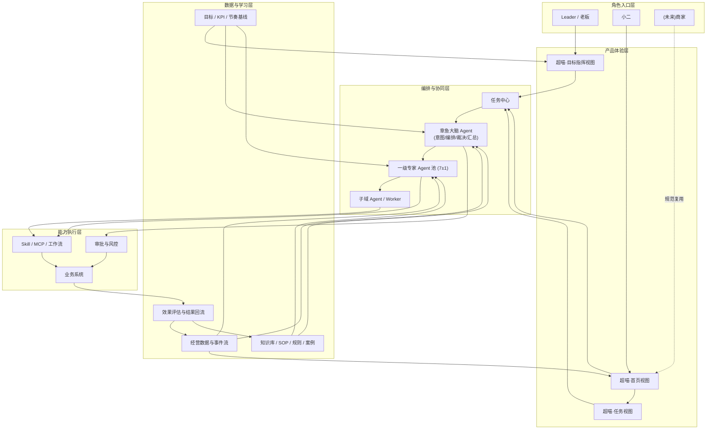

# 猫超小二端「超喵」平台方案 v2.1

文档状态:正式方案(可评审版)
编写日期:2026-04-19
适用范围:猫超小二端「超喵」平台、章鱼大脑 Agent、一级专家 Agent、任务与协同体系、猫超通用 AI 交互范式

---

## 0. 摘要

本方案要回答猫超 AI 化的核心命题:**如何让 AI 真正理解高维度生意目标、层层拆解执行,并让一线小二、横向 PM、经营 Leader 三方在同一套平台内各取所需。**

一句话结论:

> 用超喵把目标/KPI 感知、看盘、归因、策略生成、任务分发与协同执行放在同一套平台里,由章鱼大脑 Agent 负责编排、汇总与裁决,由一级专家 Agent 负责领域判断与策略生成,由子域 Agent、Skill、MCP 完成执行。

本方案的四个关键交付物:

1. 一套 **产品形态**:超喵首页态 + 任务态 + Leader 目标指挥态,同一平台三视角。
2. 一套 **Agent 架构**:章鱼大脑 + 7±1 个一级专家 + 子域 Agent/Worker + Skill/MCP 底座。
3. 一套 **A2A 协议**:任务协议、请求/响应协议、协同协议、升级协议、中断协议、版本协议。
4. 一套 **通用 AI 交互范式**:不仅服务超喵,也服务猫超所有传统系统的 AI 化(含商家端)。

本方案对三类读者的承诺:

- **对大老板**:AI 能从"季度生意目标"一路拆到"城市小二的单次动作",路径可贯通、责任可追溯、风险可管控。
- **对横向 PM**:每位 PM 知道自己建什么专家、接什么协议、按什么标准验收,平台团队提供填写示范与 Checklist。
- **对一线小二**:Day 1 就有"专家直达问答 + 单域自动归因 + 高频动作自动化"三件事可用,不用等平台全建完。

---

## 1. 背景与问题定义

### 1.1 业务背景

天猫超市正在推进一轮核心平台形态升级:将传统系统能力逐步 MCP 化、Skill 化,并通过 Agent 编排能力替代原有大量依赖人工串行处理的运营工作。平台的最终目标不是上线一个 AI 工具,而是构建一套能够支撑一线小二、横向 PM、经营 Leader 乃至更高层管理者的统一 AI 工作平台,支撑猫超生意的指数级增长。

### 1.2 三类明确输入

1. **业务侧**:运营链路覆盖供应链、物流、招商、营销、搜推、商品、价格、履约等多个领域,天然是跨域协同场景,必须通过多个专家 Agent 共同完成工作。
2. **管理侧**:希望形成统一的 A2A 交互标准,将各个域的 Agent 能力收敛到一套统一前台体验和后台协同协议中,避免各域各自建设、最终形成多个孤岛。
3. **技术侧**:不希望只有一个全知全能的大脑 Agent。若由单个大脑 Agent 承担所有专业知识、所有 Skill、所有工作规划与所有执行策略,上下文会迅速膨胀,导致质量、稳定性和可维护性下降。因此需要章鱼大脑 Agent 负责编排,具体专业策略与执行由各领域专家 Agent 负责。

### 1.3 本方案要回答的七个关键问题

1. 小二端 AI 平台的核心产品形态是什么。
2. 章鱼大脑 Agent 与各领域专家 Agent 的分工边界如何定义。
3. 专家 Agent 应该如何分层、如何控制粒度、如何与各域 PM 的建设边界对应。
4. 小二与 Agent 的统一交互方式是什么,哪些能力应该被看见,哪些复杂度应该被系统吸收。
5. 如何将数据感知、问题发现、归因分析、方案生成、任务执行、结果回流串成一个闭环。
6. **AI 如何真正贯通从"老板的生意目标"到"小二的执行动作"这条完整链路。**
7. **这套平台沉淀出来的交互范式,如何复用到猫超其他 AI 化场景(尤其是商家端)。**

---

## 2. 方案目标

### 2.1 业务目标

1. 让小二从"手工看盘 + 手工找原因 + 手工跨系统操作"转向"AI 主动发现 + AI 组织分析 + AI 推动执行"。
2. 让 Leader 从"手工下目标、追进度、跨团队协调"转向"授权策略、调边界、看偏差、做关键取舍"。
3. 让各业务域的产品能力不再以孤立系统页面的方式存在,而是沉淀为专家 Agent、子域 Agent、Skill、MCP 与知识库。
4. 建立一个可以持续扩展的 AI 平台架构,支撑后续更多域接入,而不破坏前台统一体验。
5. **支撑猫超生意的指数级增长**,体现为单小二可管理商家数、商品数、经营复杂度的大幅提升。

### 2.2 产品目标

1. 形成统一的小二端「超喵」平台产品定义。
2. 形成统一的章鱼大脑 Agent 与专家 Agent 协同机制。
3. 形成统一的 A2A 协议,含任务、请求、响应、协同、升级、中断、版本七类子协议。
4. 形成统一的前台交互范式,支撑所有域按照同一骨架接入,并可复用到商家端等其他场景。

### 2.3 非目标

1. 不定义底层具体模型选型与推理框架实现细节。
2. 不穷举每个业务域下所有 Skill 和 MCP 的技术实现。
3. 不在本阶段细化到每个页面像素级 UI 规范。
4. 不在本阶段一次性展开全部专家 Agent 的二级与三级拆分。

---

## 3. 核心判断

### 3.1 小二端不是 AI 工具,而是 AI 运营系统

如果产品只有一个聊天框,由用户主动提问,AI 再去调用工具,那么平台本质上仍然是"AI 工具"。

而猫超小二的真实工作顺序并不是"先有一个明确问题,再去问 AI",而是:看业务指标 → 判断异常或机会 → 识别原因 → 形成方案 → 推动执行 → 跟踪结果 → 复盘。

因此小二端必须具备"主动看盘、主动发现、主动归因、主动生成任务"的能力,而不是只提供一个被动问答窗口。

### 3.2 章鱼不能是万能专家,而应该是总指挥

章鱼大脑 Agent 必须存在,但不能被设计成一个装下全部知识、全部工具、全部规则和全部策略的大一统 Agent。

章鱼的正确定位是:**统一承接、统一理解、统一编排、统一裁决、统一汇总**。具体专业判断、专业策略、专业执行应下沉到各领域专家 Agent。

### 3.3 专家可见但不前置

专家 Agent 对内部建设极为重要(承载领域知识、Skill、规则、知识库与 PM ownership),但从小二端体验看,不应要求小二在任务起点先理解组织架构、先判断找哪个专家。正确的交互原则是:

1. **默认由章鱼统一承接**。
2. **任务过程中显性展示专家参与**(增强信任感和专业背书)。
3. **允许熟练用户直达专家**(快捷方式,非主入口)。
4. **不让普通用户承担前置路由成本**。

### 3.4 协议先于页面

统一交互真正要解决的不是"页面样式统一",而是"协作协议统一"。如果只有统一页面没有统一协议,各域看起来相似但实际跑不通。所以本方案先定义协议,再定义页面。

### 3.5 信任阶梯优先于功能堆砌

AI 运营系统的上限不取决于"能做多少事",而取决于"用户敢让它做多少事"。因此本方案必须同时回答"AI 出错时怎么兜底"、"哪些能力保留纯人工通道"、"系统信任度怎么分阶段建立"。

### 3.6 Leader 不是频繁下目标的人,而是策略授权者

在经营场景中,目标往往已存在于组织 KPI 体系中,平台应自动接入目标、指标表现与阶段节奏,持续识别 gap 并主动生成策略。Leader 的主要职责不是频繁从零输入目标,而是对系统生成的策略做授权、边界设定、优先级调整和重大风险决策。

---

## 4. 总体方案概述

### 4.1 统一命名:超喵

小二侧平台统一名称为 **「超喵」**。首页和任务页是超喵内部不同页面状态,不是两个独立产品。对外汇报统一讲"超喵平台",不再并列"驾驶舱"和"章鱼工作台"。Leader 视图叫"超喵·目标指挥台",同样在超喵之下。

### 4.2 总体架构图



---

## 5. 产品形态设计

### 5.1 三视角一体化

超喵是一个统一平台,对外一套品牌,对内承接三种典型工作视角:

| 视角 | 对应角色 | 核心工作 |
| --- | --- | --- |
| 首页态 | 小二 | 看盘、发现问题、初步归因、生成任务 |
| 任务态 | 小二 | 多专家协同诊断、方案、执行、跟踪 |
| 目标指挥态 | Leader | 看目标与 gap、授权策略、调边界、批重大动作 |

三种视角共用同一套底层 Agent 架构、同一套任务中心、同一套 A2A 协议。

### 5.2 首页态

#### 核心职责
1. 主动看盘,而不是等用户发问。
2. 主动发现异常与机会。
3. 主动做第一轮归因。
4. 主动生成今日待处理任务。

#### 核心模块
1. 今日经营总览
2. 目标达成与偏差
3. 异常与机会清单
4. AI 初步归因卡
5. 今日优先任务
6. 待确认事项
7. 快捷提问与人工补充入口

### 5.3 任务态

#### 核心职责
1. 统一承接任务。
2. 组织多专家协同。
3. 生成结构化建议。
4. 推动执行。
5. 回传进度、文件、结果和风险。

#### 页面结构(三栏)

- **左栏——任务清单**:当前任务、历史任务、AI 主动任务、定时任务、待确认任务。
- **中栏——统一任务线程**:章鱼主导叙事,专家通过结构化建议卡参与。
- **右栏——执行进度与文件**:状态、输出物、风险、确认事项、阶段结果。

#### 统一叙事顺序

章鱼理解问题并生成协同路由卡 → 相关专家给出结构化建议 → 章鱼汇总为统一方案 → 用户做必要确认 → 任务进入执行 → 章鱼持续回传进度与结果 → 任务完成后给出总结与后续建议。

### 5.4 Leader 目标指挥态

#### 核心需求
Leader 不逐条处理任务,也不应频繁手工下目标,而是基于平台自动读取的 KPI 表现、目标进度与经营 gap,做策略授权、边界设定、优先级调整和重大风险决策。

#### 关键能力
1. 自动拉通各团队 KPI、业务指标、目标值与阶段节奏。
2. 自动识别目标 gap、异常偏差与潜在机会。
3. 由章鱼基于 gap 自动生成 **可选策略组合**(不少于 2 条,供 Leader 选择)。
4. Leader 对策略做授权、参数调整、优先级排序与边界约束。
5. 系统将批准后的策略自动拆解为任务并分发到对应团队与小二。
6. Leader 持续查看目标推进状态、升级风险与关键执行偏差。

#### 本期 Leader 模式的取舍
- **做**:KPI/目标接入、gap 识别、策略选项生成、任务分发、进度追踪、重大确认。
- **不做**:情景模拟(如"预算从 A 挪到 B 会怎样")——此项需要强因果建模,放到第三阶段。

---

## 6. Agent 分层设计

### 6.1 三类数量的清晰区分

Agent 体系不应只讨论"总共有多少个",而应区分三类数量:

1. **用户可见的 Agent 数量**:建议 8±1(1 个章鱼 + 7 个一级专家)。
2. **平台一级治理的 Agent 数量**:与用户可见数相同,由平台团队统一治理。
3. **后台实际运行的 Agent 数量**:无上限,由各域自治(子域 Agent/Worker)。

### 6.2 第 0 层:章鱼大脑 Agent

章鱼是总指挥,不是全科专家。详细产品能力定义见 §7。

### 6.3 第 1 层:一级专家 Agent(7 个,最多 8 个)

#### 为什么是 7±1 个

认知负载研究表明人类短期记忆容量约 7 个对象;过多会让章鱼路由决策空间爆炸,过少会让单个专家内部复杂度失控。7 是认知友好度与建设可行性之间的平衡点。

#### 一版建议专家列表

| 一级专家 Agent | 核心职责 | 对应当前初步定义 |
| --- | --- | --- |
| 经营分析专家 | 目标追踪、异常识别、机会发现、归因分析、任务建议 | 目标&经营分析Agent |
| 商品经营专家 | 宫格规划、选品、链接诊断、商品结构、成长策略 | 宫格规划&选品Agent、链接运营诊断Agent |
| 增长营销专家 | 场景活动、权益设计、资源调控、城市经营打法、营销增长方案 | 场景活动Agent、城市托管Agent |
| 商家经营专家 | 招商、商家协同、供给拓展、商家经营推进 | 招商Agent |
| 供应链计划专家 | 网络规划、物流规划、补货、库存健康、供给承接 | 物流规划Agent、网络Agent、补货Agent |
| 履约运营专家 | 仓储、配送、履约质量、异常治理、末端体验 | 仓储Agent、配送Agent、履约Agent |
| 价格管理专家 | 价格查询、价格诊断、价格管控、价格建议 | 价格管理Agent |

#### 关于流量搜推
流量搜推是猫超生意的核心变量。本方案建议第一期即把"流量搜推"作为第 8 个一级专家纳入建设范围,而不是放到后续。因为一旦 GMV 异常发生,流量维度几乎总是归因必经路径,缺位会导致归因链路断裂。

### 6.4 专家之间的职责交叉与冲突处理

专家之间有归因职责的天然重叠(比如商品/价格/营销都会对"商品卖不动"给出判断)。处理原则:

1. **经营分析专家是归因链路的编排者**,它负责"这个问题该从哪些维度拆解",但不给终局结论。
2. **各领域专家在各自维度内给终局结论**:价格专家只说价格侧、商品专家只说商品侧,严禁越界。
3. **冲突裁决由章鱼负责**,详见 §7.4。

### 6.5 第 2 层:子域 Agent / Worker

子域 Agent 用于各域内部细分能力拆分,由各领域自治定义,**默认不暴露给小二**。目标是减少一级专家内部复杂度,而不是新增前台入口。

举例:
- 供应链计划专家下:补货、网络、物流仿真等子域 Agent。
- 商品经营专家下:宫格、选品、链接诊断、生命周期管理等子域 Agent。
- 增长营销专家下:活动、权益、投放、素材、城市经营等子域 Agent。

### 6.6 第 3 层:Skill / MCP / 知识库

完全后台化,是专家 Agent 的工具,不直接成为用户的心智对象。

---

## 7. 章鱼大脑 Agent 产品能力定义

> **这一节是本方案的核心之一,定义章鱼作为一个独立产品的能力边界。**
> **这些能力统一由平台团队建设,不属于任何域 PM 的职责。**

### 7.1 意图理解能力

- **输入**:自然语言 + 当前上下文(页面/任务/数据/用户画像)。
- **输出**:结构化意图,字段含业务对象、目标指标、动作类型、紧急度、时效约束、已知信息完整度。
- **实现要点**:需要一份"意图分类体系"作为训练与规则基础,第一期建议覆盖约 30 类高频意图(如"诊断 GMV 下跌"、"生成补货建议"、"评估活动 ROI"),由经营分析专家提供初版语料。

### 7.2 编排决策能力

给定结构化意图,决定:拉哪些专家、什么顺序、串行还是并行、谁是主专家、谁是辅助、各专家超时预算、失败回退策略。

- **编排知识来源**:三层——(1)规则表(人工配置的高频路由模式)、(2)专家元知识库(每个专家声明自己擅长处理哪类意图)、(3)历史任务学习(哪些编排组合历史上成功率高)。
- **第一期兜底**:若无法做自动编排,降级为"规则表 + 默认全专家并行广播",确保兜底可跑。

### 7.3 上下文管理能力

- 在多轮对话、多专家协同、跨任务引用之间保持上下文一致。
- **上下文传递策略**:章鱼不向专家传原始长对话,传结构化任务摘要 + 必要的历史专家结论压缩(硬性限制每段 < 2000 tokens)。
- 支持上下文版本控制,便于任务回溯与问题复现。

### 7.4 冲突裁决能力 ⭐

**这是章鱼最值钱的能力,也是平台区别于"几个独立专家拼起来"的根本护城河。**

- **冲突识别**:识别 N 个专家结论之间的矛盾类型(结论冲突、优先级冲突、资源冲突、风险冲突)。
- **裁决机制**:
  1. 优先级规则(例:价格合规 > 毛利 > GMV)。
  2. 数据置信度加权(谁的数据更完整谁权重更高)。
  3. 历史案例匹配(类似冲突过去怎么解)。
  4. 以上都无法裁决时,升级为"用户选择卡",交由小二或 Leader 决定,并沉淀为新的裁决规则。
- **关键设计**:**章鱼必须在任务线程中显性呈现冲突和裁决依据**,不能静默选择某一方结论——这是平台信任度的基础。

### 7.5 汇总表达能力

- 把 N 个专家的结构化输出压成"一句话结论 + 可展开依据 + 推荐下一步"。
- 支持折叠/展开两级信息密度。
- 移动端场景默认只展示一句话结论 + 三个关键动作按钮。

### 7.6 风险识别能力

- 自动识别任务中触碰高风险动作清单的步骤(见 §9.6),自动加确认流程。
- 支持风险分级(低/中/高/极高)与差异化确认策略。

### 7.7 记忆与学习能力

- 对历史任务做结构化沉淀:成功编排模式、失败案例、用户偏好、领域规则演进。
- 沉淀结果反哺编排决策能力(见 §7.2)与意图理解能力(见 §7.1)。
- **第一期仅做"结构化存储 + 规则萃取"**,不做在线学习,避免早期噪声污染规则库。

### 7.8 章鱼不做什么(边界声明)

1. 不承载任何领域的深度知识库。
2. 不直接调用 Skill/MCP(必须通过某个专家 Agent)。
3. 不给出领域结论,只给编排、汇总、裁决结论。
4. 不做情感化、价值观判断类的用户陪伴(非经营场景不服务)。

---

## 8. 超喵 A2A 协议规范 v1.0

> **这一节是本方案的第二个核心。没有这套协议,"统一 A2A"就只是口号。**
> **建议本协议文本化后,独立作为《超喵 A2A 协议规范 v1.0》文档,作为各域 PM 接入的唯一技术依据。**

### 8.1 任务协议

每个任务在任务中心的标准结构:

```json
{
  "task_id": "TSK-2026-04-19-00123",
  "source": "AI_DISCOVERY | USER_INITIATED | LEADER_DISPATCH | EXPERT_ESCALATION",
  "type": "DIAGNOSE | PLAN | EXECUTE | MONITOR | REVIEW",
  "business_object": {
    "type": "SKU | BRAND | CATEGORY | MERCHANT | CITY | CAMPAIGN | LINK",
    "id": "...",
    "scope": "..."
  },
  "target_metric": {
    "name": "GMV | MARGIN | CVR | ROI | STOCK | FULFILLMENT_RATE",
    "baseline": 0.0,
    "target": 0.0,
    "deadline": "ISO8601"
  },
  "trigger_reason": "...",
  "participating_experts": ["..."],
  "state": "CREATED | DIAGNOSING | PLANNING | PENDING_CONFIRM | EXECUTING | TRACKING | DONE | BLOCKED",
  "priority": "P0 | P1 | P2 | P3",
  "risk_level": "LOW | MEDIUM | HIGH | CRITICAL",
  "requires_approval": true,
  "result_summary": "...",
  "knowledge_captured": false,
  "parent_task_id": "...",
  "context_version": "v1"
}
```

### 8.2 请求协议(章鱼 → 专家)

```json
{
  "request_id": "REQ-...",
  "task_id": "TSK-...",
  "sub_intent": "...",
  "context_summary": "...",
  "shared_data": { "... 必要数据引用,非原文 ..." },
  "permission_scope": ["READ_SKU", "READ_PRICE", "WRITE_PRICE_PROPOSAL"],
  "timeout_ms": 15000,
  "priority": "P0|P1|P2|P3"
}
```

### 8.3 响应协议(专家 → 章鱼)

```json
{
  "request_id": "REQ-...",
  "expert_id": "EXPERT_PRICE",
  "diagnosis": "...",
  "evidence": [...],
  "recommended_actions": [...],
  "estimated_impact": { "metric": "GMV", "delta": "+5%~+8%" },
  "risks": [...],
  "confidence": 0.82,
  "data_completeness": "FULL | PARTIAL | INSUFFICIENT",
  "needs_collaboration_with": ["EXPERT_MARKETING"],
  "recommend_immediate_execution": false,
  "requires_human_confirm": true
}
```

### 8.4 协同协议(专家之间)

**核心原则:专家之间不直接对话,一律通过章鱼中转。**

- 避免多专家形成环状调用导致不可追溯。
- 避免专家 A 以专家 B 的身份执行动作。
- 章鱼作为唯一协同枢纽,便于裁决与审计。
- 例外:同一一级专家下的子域 Agent 之间可直接协作(由该一级专家自行治理)。

### 8.5 升级协议(专家 → 章鱼)

当专家在执行中发现:
1. 问题超出自己的职责边界(如价格专家发现问题根因在供应链)。
2. 需要补充跨域数据才能继续。
3. 发现新的风险项。

应主动发起 `ESCALATE` 请求,触发章鱼重新编排。升级请求必须含"升级原因"字段,供后续学习。

### 8.6 中断协议

当用户中途修改目标、撤回任务、切换优先级时,章鱼向所有已启动专家发送 `CANCEL` 或 `UPDATE_CONTEXT`。专家收到后须:
1. 停止尚未开始的动作。
2. 保留已经产生的中间结论(不丢弃)。
3. 返回"中断回执",声明当前任务进度。

### 8.7 版本协议

- 每个专家 Agent 声明自己的 `capability_version`。
- 任务创建时快照参与专家版本号,保证老任务重放一致性。
- 章鱼支持"版本兼容范围"配置,避免某专家升级后所有历史任务失效。

### 8.8 本协议的"不做"清单

1. 不定义底层通信实现(HTTP/gRPC/MQ 由技术方案决定)。
2. 不定义专家内部实现语言或框架。
3. 不定义 UI 呈现(UI 由 §10 交互范式定义)。

---

## 9. 统一任务协作机制

### 9.1 任务来源

统一分为五类:

1. **小二主动发起**:用户带明确问题发起。
2. **AI 异常与机会发现**:首页基于数据异常、机会、风险自动生成。
3. **目标 gap 自动触发**:平台基于 KPI 目标、当前进度和阶段节奏识别偏差,自动生成策略任务。
4. **Leader 专项输入**:Leader 临时新增专项目标、边界或资源约束。
5. **专家升级生成**:某专家在执行中发现跨域问题或新风险,升级生成新任务。

### 9.2 任务类型

诊断任务 / 方案任务 / 执行任务 / 监控任务 / 复盘任务。

### 9.3 任务状态流转

```
新建 → 诊断中 → 方案中 → 待确认 → 执行中 → 跟踪中 → 已完成 / 已阻塞
```

### 9.4 专家标准输出格式

见 §8.3 响应协议,字段固定为:诊断结论、判断依据、建议动作、预估影响、风险点、协同方、置信度、数据完整性、是否立即执行、是否需要确认。

### 9.5 任务完成标准

一个任务是否结束,不以"AI 回完话"为准,而以五条综合判断:
1. 是否形成明确诊断或方案。
2. 是否完成关键执行动作。
3. 是否回传结果与进度。
4. 是否判断需要继续跟踪。
5. 是否沉淀为 SOP、案例或知识。

### 9.6 高风险动作清单与分级确认

| 动作类型 | 风险等级 | 确认策略 |
| --- | --- | --- |
| 价格调整 | HIGH | 小二确认,单品金额超阈值升级 Leader 确认 |
| 预算分配 | CRITICAL | Leader 确认 |
| 权益投放 | HIGH | 小二确认 |
| 资源位占用 | HIGH | 小二确认 |
| 商家承诺 | CRITICAL | Leader 确认,留痕至商家关系系统 |
| 处罚与规则动作 | CRITICAL | 双人确认 |
| 重大补货与供给策略调整 | HIGH | 小二确认 |
| 重大履约策略调整 | HIGH | 小二确认,末端影响大则 Leader 确认 |

**所有高风险动作不允许静默自动执行。**

---

## 10. 猫超 AI 产品通用交互范式

> **这一节是本方案的第三个核心。它将超喵沉淀出的设计,抽象为可复用于商家端、品牌端、其他业务 AI 化场景的通用范式。**

### 10.1 核心原则

1. **专家可见,但不前置;专家参与可见,路由由章鱼负责。**
2. **协议先于页面。**
3. **信任阶梯优于功能堆砌。**
4. **静默执行受限,显性确认优先。**

### 10.2 通用交互原子(五张卡)

这五种卡是任何 AI 产品都应采用的最小交互单元:

| 卡类型 | 发起方 | 内容 |
| --- | --- | --- |
| 协同路由卡 | 章鱼 | 问题理解、待拉起专家、各专家职责、可执行部分、需确认部分 |
| 专家建议卡 | 一级专家 | 诊断、依据、建议、预估、风险、是否需协同、是否需确认 |
| 执行进度卡 | 章鱼/专家 | 动作、进度、预计耗时、产出文件、状态 |
| 确认卡 | 章鱼 | 高风险动作的人机确认 |
| 结果卡 | 章鱼 | 最终结论、执行结果、指标变化、后续建议 |

### 10.3 通用工作流骨架

经营治理类 AI 任务通常遵循:

```
目标 / KPI 自动接入 或 主动发现 / 用户发起
 → gap / 意图结构化
 → 自动生成策略组合 / 编排拉起专家
 → Leader 授权 / 调整 / 用户确认
 → 任务拆解
 → 执行
 → 结果回流
 → 知识沉淀
```

### 10.4 通用治理机制

- **高风险动作清单**:每个场景都应定义自己的清单(不仅限小二端)。
- **分级确认策略**:单人 / 双人 / Leader 确认三档。
- **全链路留痕**:每个确认、每个执行、每个专家结论均留痕可审计。

### 10.5 不建议采用的模式

1. 首页只给一个空白输入框。
2. 让用户先在一堆专家中手工选择。
3. 把所有子域 Agent 平铺成前台入口。
4. 多个专家在独立对话窗口中各说各话,由用户自己整合。

### 10.6 复用边界

此范式**强复用**于:商家端 AI、品牌端 AI、采购端 AI、猫超内部其他后台 AI 化。

此范式**不强复用**于:用户侧面向 C 端消费者的 AI(因为 C 端不需要"专家可见"的结构)。

---

## 11. 端到端样例:从老板关注的季度目标 gap 到小二的一次补货

> **用一个完整链路打通方案,让老板、PM、小二三方都能找到自己的位置。**

### 场景输入

平台已接入 Q2 生鲜类目 KPI 目标:

- GMV 同比增长 20%
- 毛利率不下降

当前经营看板显示:

- Q2 进度已过半,生鲜 GMV 仅达成阶段目标的 87%。
- 华东牛奶、华北肉禽是主要 gap 来源。
- 毛利率逼近警戒线。

章鱼据此自动识别"目标 gap",并触发策略生成流程。Leader 进入目标指挥台时,看到的是系统生成的策略包,而不是一张等待手工输入的空白表单。

### 步骤 1:章鱼识别 gap → 生成策略路径

章鱼调用经营分析专家 + 商品经营专家 + 增长营销专家 + 供应链计划专家 + 价格管理专家,**并行征询**每位专家对"如何修复当前目标 gap"的看法。

各专家分别返回结构化建议(按 §8.3 协议格式)。章鱼汇总后,**给 Leader 三条策略选项**:

- **选项 A「供给扩容主导」**:新增 2000 SKU、2 个新城市上线、预期 +18%~+22% GMV、资源消耗中、风险低。
- **选项 B「活动加码主导」**:3 场大促 + 品类周、预期 +15%~+25% GMV、预算消耗高、毛利承压。
- **选项 C「组合拳」**:A + B 按 6:4 资源配比、预期 +22%~+28% GMV、预算消耗中高、执行复杂度高。

### 步骤 2:Leader 授权 / 调整 → 任务分发

Leader 选 C,并在确认卡上批准预算、调整资源配比边界,确认优先保障毛利率不击穿阈值。

章鱼自动拆解 C 为一批具体任务,按业务对象(城市/类目/商家)路由到对应小二:

- 华东区生鲜负责小二 A:"华东区牛奶品类补货扩容 + 配合大促"。
- 华北区生鲜负责小二 B:"华北区肉禽品类选品扩容"。
- ……

### 步骤 3:小二 A 的任务态

小二 A 在超喵首页看到一条新任务,点进任务态:

- **章鱼发协同路由卡**:"本任务涉及商品扩容 + 供应链承接 + 价格验证 + 履约评估,我将拉起 4 位专家。"
- **商品经营专家建议卡**:推荐扩容 SKU 清单、供应商、预估周销量。
- **供应链计划专家建议卡**:补货节奏、安全库存、仓配资源承接情况。
- **价格管理专家建议卡**:价格区间建议、合规校验、竞对比价。
- **履约运营专家建议卡**:末端承接压力评估、异常风险提示。

**此时若出现冲突**(例:价格专家说建议定价 ¥12.9,商品专家为保毛利建议 ¥13.9),章鱼在任务线程中**显性呈现冲突和裁决依据**,默认按"毛利优先于 GMV"规则裁决,或升级给小二 A 选择。

### 步骤 4:小二 A 确认 → 执行

小二 A 在确认卡上逐项批准(或修改)。触发执行层:

- 供应链 Skill:生成补货单 → 接入补货系统。
- 商品 Skill:建链 → 接入商品系统。
- 价格 Skill:挂价 → 接入价格系统(金额超阈值自动走审批)。

### 步骤 5:结果回流 → 贯穿全链路

执行结果沿链路逐层回传:

小二 A 的任务态看到「日补货单执行结果 + 出库数据」→ 章鱼汇总到该小二的本周任务总结 → 再汇总到 Leader 的目标指挥台「华东区生鲜执行进度」→ 最终汇总到 Leader 的「Q2 目标达成看板」。

### 这个样例同时回答了四件事

1. **对 Leader**:AI 真的能把 Q2 目标拆到城市、到品类、到具体动作,每一步可追溯。
2. **对 Leader 的交互方式**:日常不必频繁手工下目标,而是看系统识别出的 gap、审核策略、做关键授权。
3. **对 PM**:每位 PM 知道自己的专家在这条链路里的位置(比如价格 PM 看到价格专家在步骤 1、步骤 3 和步骤 4 怎么出场)。
4. **对小二**:AI 不是抢走我的判断,而是帮我把商品、供应链、价格、履约四个专业判断组合好给我,我只需要确认和调整。

---

## 12. 小二端 Day 1 最小可用路径

> **承诺:不等平台全建完,小二第一阶段就能用上三件事。**

### 12.1 为什么需要 Day 1 路径

AI 运营系统的完整闭环(主动看盘 → 归因 → 跨域协同 → 执行 → 回流)建成至少需要 9 个月。但小二不能等。如果 Day 1 没东西可用,组织信心会被消耗殆尽。

因此本方案设计三个"单点可用"能力,**不依赖章鱼完整编排能力,不依赖跨域数据底座,单一专家 Agent 即可跑通**,预计 3 个月内交付。

### 12.2 Day 1 三件套

#### 能力 1:专家直达问答

- **场景**:小二选"价格专家",直接问"这批商品为什么破价了"。
- **实现依赖**:价格专家 Agent + 价格系统 MCP + 价格知识库。
- **不依赖**:章鱼编排、跨域数据、主动感知。
- **交付时间**:T + 3 个月(随第一批 2~3 个专家 Agent 同步上线)。

#### 能力 2:单域自动归因卡

- **场景**:小二打开超喵看到"昨日 GMV -8%",系统直接挂出"流量 -3% / 转化 -4% / 客单 -1%"三因素拆解。
- **实现依赖**:经营分析专家 + 核心经营数据源(已存在)。
- **不依赖**:主动发现引擎(规则引擎即可)、多专家协同。
- **交付时间**:T + 3 个月。

#### 能力 3:高频动作自动化

- **场景**:小二说"帮我把这批链接的价格同步更新",系统直接按规则执行。
- **实现依赖**:意图识别(有限类目) + 价格 Skill + 审批流。
- **不依赖**:章鱼通用编排、跨域协同。
- **交付时间**:T + 2 个月(覆盖 3~5 类高频动作)。

### 12.3 Day 1 与完整平台的关系

Day 1 三件套不是"临时方案",而是完整平台的 **首批落地组件**:

- 能力 1 会演进为"任务态中的专家直达入口"。
- 能力 2 会演进为"首页态的初步归因卡"。
- 能力 3 会演进为"任务态的执行层 Skill 复用池"。

### 12.4 对三方的价值

| 对象 | Day 1 就能感受到的价值 |
| --- | --- |
| 小二 | 减少跨系统切换;价格相关问题 80% 可在超喵内解决 |
| 横向 PM | 各域可优先把自己的专家 Agent 按这三种形态上线,不用等整套协议全建完 |
| Leader | 可验证 AI 真的能进入一线工作流,而不仅是 Demo |

---

## 13. 失败与兜底设计

> **本节回答"AI 出错时怎么办",这是信任阶梯的基础。**

### 13.1 四类典型失败场景

| 失败场景 | 系统行为 | 用户感受 |
| --- | --- | --- |
| 章鱼意图理解错误 | 允许小二一键"重新理解"或直接切到专家直达 | "AI 理解错了但能快速纠偏" |
| 专家无响应或超时 | 章鱼自动降级:缺该专家的部分显性标注为"未收到建议",其余专家结论照常输出 | "不是整个任务挂掉,而是缺一块" |
| 专家结论置信度过低 | 章鱼不直接给结论,而是暴露"证据不足,建议人工介入",并给出缺失的数据维度 | "AI 坦诚自己不知道,好过乱答" |
| 执行 Skill 失败 | 自动回滚 + 风险告警;同步人工操作链路作为兜底 | "不会把脏数据留在业务系统" |

### 13.2 必须保留的纯人工通道

即便平台全建成,以下通道永不关闭:

1. 原有业务后台的关键操作入口(价格改动、补货下单等)。
2. 小二跨过 AI 直接联系技术/产品的人工响应通道。
3. 任务任意阶段的"接管"按钮,小二可随时从 AI 手里接走任务变为纯人工处理。

### 13.3 信任阶梯(三档)

| 阶段 | 信任等级 | AI 默认行为 |
| --- | --- | --- |
| T+3 ~ T+6 月 | 低信任 | 所有动作显式人工确认,AI 仅出建议 |
| T+6 ~ T+12 月 | 中信任 | 低风险动作可自动执行(<阈值的重复动作),中高风险仍需确认 |
| T+12 月后 | 高信任 | 经过历史数据验证的高频动作开放"默认自动 + 事后抽查",小二可个性化调整信任等级 |

这份阶梯本身就是产品能力的一部分,需要在 Leader 目标指挥台提供可视化。

---

## 14. 组织分工与治理机制

### 14.1 平台团队职责(含章鱼 Owner)

1. 章鱼大脑 Agent 定义(§7 七项能力)。
2. 一级专家框架(§6)。
3. A2A 协议体系(§8)。
4. 交互范式(§10)。
5. 风控与审批机制(§9.6)。
6. 共性数据与知识底座。
7. 失败兜底与信任阶梯治理(§13)。

### 14.2 各域 PM 职责

1. 定义本域一级专家职责边界。
2. 梳理本域子域 Agent。
3. 建设本域 Skill / MCP / 知识库。
4. 定义本域风险与审批规则。
5. 按统一协议(§8)输出本域结果。

### 14.3 一级专家 Agent 建设 Checklist(发给每位域 PM)

| 项 | 是否完成 | 验收标准 |
| --- | --- | --- |
| 领域专家定义表 | ☐ | 职责边界、覆盖意图清单、不做事项清单 |
| 子域 Agent 拆分表 | ☐ | 至少覆盖本域 80% 的核心动作 |
| Skill / MCP 能力清单 | ☐ | 输入/输出/权限/幂等性声明 |
| 知识库范围说明 | ☐ | 规则、SOP、历史案例、策略模板 |
| 输入输出格式(按 §8 协议) | ☐ | 字段完整 + 置信度 + 数据完整性 |
| 风险与确认动作清单 | ☐ | 按 §9.6 分级模板填写 |
| 冲突场景自评 | ☐ | 列出本专家最可能与哪些专家冲突、建议裁决规则 |
| 失败兜底方案 | ☐ | 无响应、超时、置信度低时的降级行为 |

### 14.4 填写示范

建议平台团队用"价格管理专家"或"商品经营专家"作为范例,**完整填写一份示范文档**,发给各域 PM 对照填写。示范文档作为 §18 后续建议之一。

### 14.5 评审与验收节奏

- 各域初稿:T+1 月内提交。
- 平台交叉评审:T+1.5 月。
- 首批专家上线:T+3 月。
- 季度复盘与协议 v1.1 迭代:T+6 月。

---

## 15. 分阶段落地

### 15.1 T+3 月:Day 1 可用

1. 交付首批 2~3 个专家 Agent(建议优先价格、商品、经营分析)。
2. 交付 Day 1 三件套(§12)。
3. 发布 A2A 协议 v1.0 供全域对照。
4. Leader 目标指挥台 MVP(含 KPI/目标接入 + gap 识别 + 策略选项,无自动任务分发)。

### 15.2 T+6 月:首页态与任务态闭环

1. 超喵首页态上线(含主动归因、优先任务、待确认事项)。
2. 任务态上线(含协同路由卡、专家建议卡、执行进度卡、确认卡、结果卡)。
3. 章鱼 §7.1-7.5 能力上线,§7.6-7.7 为基础版。
4. 5 个一级专家上线,覆盖关键经营链路。

### 15.3 T+9 月:全域接入与 Leader 模式完整化

1. 7~8 个一级专家全部上线。
2. Leader 模式含目标拆解、任务分发、进度追踪、重大确认。
3. 章鱼记忆与学习能力进入在线版。
4. 通用交互范式对外发布,启动商家端复用试点。

### 15.4 T+12 月及以后

1. 信任阶梯进入高信任档位。
2. 情景模拟能力进入 Leader 模式。
3. 跨猫超多场景 AI 范式复用。

---

## 16. 关键成功指标

### 16.1 业务结果指标

1. 单小二可管理商家数、商品数。
2. 经营目标达成率提升。
3. 履约、库存、价格等关键经营指标改善。
4. 猫超 GMV 增速(相对控制组)。

### 16.2 效率指标

1. 发现问题到形成方案平均时长。
2. 方案到执行完成平均时长。
3. 小二跨系统切换次数。
4. 重复性动作自动化率。

### 16.3 平台运行指标

1. AI 主动生成任务占比。
2. 章鱼跨域任务成功编排率。
3. 专家建议采纳率。
4. 冲突裁决准确率(人工抽检)。
5. 高风险动作确认通过率。
6. 知识与复盘沉淀率。

### 16.4 信任度指标(新增)

1. 小二接管率(从 AI 手里接走任务的比例,越低越好)。
2. 用户对建议卡的平均采纳率。
3. AI 回答"我不知道"的比例(适中为佳,过低反而说明虚构)。

---

## 17. 主要风险与应对

### 17.1 风险:只有统一页面,没有统一协议
- **应对**:优先建设 §8 A2A 协议规范,交互规范以协议为核心。

### 17.2 风险:章鱼过重,成为新的单点瓶颈
- **应对**:严格按 §7.8 边界声明限定章鱼能力;专业策略下沉。

### 17.3 风险:专家过多,前台变成 Agent 超市
- **应对**:一级专家 7±1;子域后台化;默认章鱼承接。

### 17.4 风险:只有执行,没有主动发现
- **应对**:首页态必须承担主动经营感知,优先建设数据感知与异常识别。

### 17.5 风险:高风险动作缺少治理
- **应对**:§9.6 清单 + §13 兜底 + §13.3 信任阶梯。

### 17.6 风险:专家冲突裁决质量低
- **应对**:§7.4 冲突裁决设计 + §14.3 Checklist 中"冲突场景自评"项。

### 17.7 风险:小二 Day 1 没东西用,组织信心流失
- **应对**:§12 Day 1 三件套先行交付。

### 17.8 风险:各域 PM 接入标准不一,范式落空
- **应对**:§14.3 Checklist + §14.4 填写示范 + 首期交叉评审。

### 17.9 风险:范式只服务小二端,无法复用到商家端
- **应对**:§10 明确复用边界与范式抽象;T+9 月启动商家端试点。

---

## 18. 最终结论与后续建议

### 18.1 一句话结论

> 用超喵把看盘、归因、任务生成与协同执行放在同一套平台里,由章鱼大脑 Agent 负责编排、汇总与裁决,由一级专家 Agent 负责领域判断与策略生成——这套方案既是猫超小二端的 AI 平台,也是猫超全场景 AI 化的通用范式。

### 18.2 本方案对四方的承诺

- **对大老板**:§11 端到端样例 + §15 阶段规划,证明 AI 能从 Q 级目标贯通到小二动作。
- **对横向 PM**:§14.3 Checklist + §14.4 填写示范,让每位 PM 都能照做。
- **对一线小二**:§12 Day 1 三件套,3 个月即可感受 AI 价值。
- **对平台团队自身(含我作为章鱼 Owner)**:§7 章鱼产品能力定义 + §8 A2A 协议,明确平台团队的 ownership 边界。

### 18.3 后续建议产出的配套材料

1. **《章鱼大脑 Agent 产品能力规范 v1.0》**——展开 §7 七项能力的详细设计。
2. **《超喵 A2A 协议规范 v1.0》**——独立成册 §8 全部协议。
3. **《一级专家 Agent 建设指南与填写示范》**——基于 §14.3 Checklist,用价格/商品专家做范例。
4. **《超喵首页与任务页原型说明》**——详细 UI/交互原型。
5. **《猫超 AI 产品通用交互范式白皮书》**——§10 范式独立成册,供商家端等场景复用。

当这五份材料补齐,即可进入高效内部评审与老板汇报阶段。
