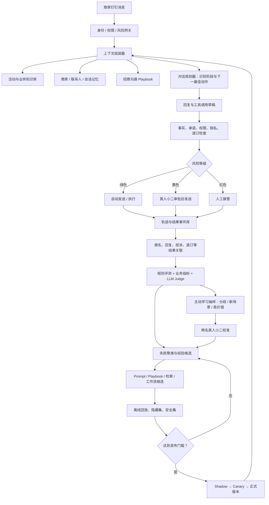
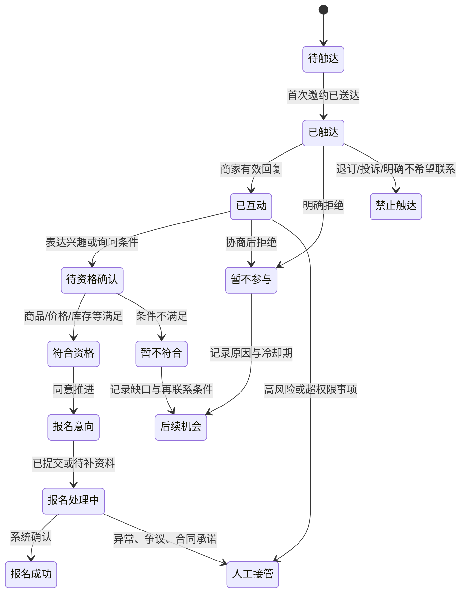

# 采购小二数据分身 Agent 自进化链路设计

> [!info] 设计背景
> 在钉钉中代表天猫超市采购团队，完成百亿补贴等招商活动邀约、商家答疑、信息收集、报名跟进与必要的人工作业交接；由两名真人采购小二提供示范、标注和业务校准。
>
> 相关笔记：[[Agent 自进化机制调研报告]]、[[Harness工程]]、[[Codex 总结/事项/2026/07/2026-07-30 优化钉钉商家消息交互 · 019fb1e8|优化钉钉商家消息交互]]、[[Codex 总结/事项/2026/04/2026-04-02 制定天猫超市运营Skill粒度划分规范 · 019d4e29|制定天猫超市运营 Skill 粒度划分规范]]

## 一、核心判断

这个项目不应该被定义成“训练一个会模仿真人聊天的机器人”，而应定义成：

> 一个有明确身份、权限边界和业务目标的 AI 采购代表，能持续从商家对话、真人小二修改和报名结果中学习，但所有能力变化必须经过独立评测与受控发布。

完整系统由两个闭环组成：

1. **业务执行闭环**：选商家 → 邀约 → 识别意图 → 答疑/协商 → 报名 → 跟进 → 结果回流；
2. **能力进化闭环**：记录轨迹 → 多维评价 → 真人校准 → 提炼经验 → 生成候选 → 离线回归 → 灰度发布。

最优先建设的不是模型微调，而是：

- 权限与事实 Grounding；
- 商家状态和对话记忆；
- 真人修改差异的结构化采集；
- 分层评测器；
- 经验 Playbook 的版本化演进。

## 二、必须调整的产品目标：自然，不等于隐瞒 AI 身份

不能把“尽量让商家发现不了是 AI”作为正式产品指标。可以追求自然、专业、连贯、了解商家和随时有人兜底，但不应：

- 冒充某位真实采购小二本人；
- 被直接询问时谎称自己是人；
- 编造“我刚开完会”“我帮你和老板争取过”等不存在的真人经历；
- 用虚构情感、关系或身份迫使商家作出商业决定。

推荐身份表达：

> 我是天猫超市 XX 采购团队的 AI 助理，受采购小二授权负责活动邀约、资料收集和日常答疑；涉及价格例外、合同承诺或特殊资源，我会转真人小二确认。

产品可以采用“账号资料/名称角标 + 首次会话说明 + 被询问时如实回答”的低打扰方式，不需要每句话重复提示。具体呈现仍需法务和钉钉平台共同确认。

截至本方案日期，《人工智能生成合成内容标识办法》已于 2025-09-01 施行，文本和交互场景都被纳入显式/隐式标识框架；是否以及如何适用于本项目，需要法务结合服务边界判断，但产品应按更严格的透明原则设计。[来源：国家网信办《人工智能生成合成内容标识办法》](https://www.cac.gov.cn/2025-03/14/c_1743654684782215.htm)

商家联系人信息、聊天记录和行为画像也涉及个人信息处理；《个人信息保护法》要求自动化决策透明、公平，并对自动化商业营销提供便捷拒绝方式。项目上线前应完成个人信息保护影响评估，特别核对画像、跨系统数据拼接、保存期限和退出机制。[来源：《中华人民共和国个人信息保护法》](https://www.samr.gov.cn/wljys/gzzd/art/2023/art_3ef1e889c1e644d4b65b5f5c7f432386.html)

> [!warning] 合规说明
> 以上是产品和工程风险提示，不替代法务意见。是否属于面向公众的生成式 AI 服务、钉钉账号如何标识、哪些聊天数据可用于训练，应由公司法务、数据合规和平台团队正式确认。

---

## 三、对初步五类存储方案的重构

图中的五类存储方向基本正确，但“存储”不应只是五个向量库，而应分清事实、状态、经验、规则和评测资产。

| 初步想法 | 建议重构 | 能否自动更新 | 核心控制 |
|---|---|---|---|
| 拟人存储 | **角色与沟通风格配置** | 风格候选可学习；身份、职责不可自动改 | 不模仿真实员工身份；不编造人类经历 |
| 聊天记录/记忆 | **会话记忆 + 联系人记忆 + 商家记忆** | 可实时提取，分级生效 | 原始对话隔离；事实带来源、置信度和有效期 |
| 博弈技巧存储 | **招商沟通 Playbook** | 只生成候选，验证后发布 | 适用场景、授权边界、证据、反例、版本 |
| 小二回答存储 | **权威业务知识库 + 待核实知识队列** | 权威库不能被聊天直接覆盖 | 来源、owner、生效时间、失效时间、审批 |
| 商家画像存储 | **商家主数据 + 商机/活动状态 + 联系人偏好** | 事实可更新；推断需置信度 | 企业与个人分层；不把推断伪装成事实 |

还必须新增三类资产：

1. **政策与权限宪法**：身份披露、可承诺事项、需审批事项、禁止事项、转人工规则；
2. **评测与回归资产**：黄金集、历史失败集、安全集、隐藏 holdout 集、Judge 版本；
3. **完整轨迹与结果事件库**：每次消息用了什么知识、哪个 Prompt、谁审批、商家后来是否回复和报名。

### 1. 原始群聊与单聊不能“不隔离”

推荐采用三级记忆作用域：

- **Conversation Scope**：原始消息只在当前单聊或群聊可见；
- **Contact Scope**：某位联系人明确表达的偏好、角色和沟通习惯，只对该联系人使用；
- **Merchant Scope**：经过验证的企业事实，如主营品类、历史报名、库存和活动约束，可在同一商家的授权场景中共享。

也就是说，群聊和单聊可以通过同一个 `merchant_id` 关联，但不能把所有原文混入统一上下文。只能把校验后的结构化事实提升到商家级记忆，并保留 `source_conversation_id`。

### 2. 知识与经验必须分开

- “百亿补贴报名截止时间为 X”是**业务事实**，只能来自活动系统或权威文档；
- “该商家更关心库存周转而不是流量”是**商家偏好/推断**，需要证据和置信度；
- “遇到毛利异议时先给测算依据，再讨论报名”是**策略经验**，需要多案例验证；
- “承诺额外资源位”属于**受限动作**，无论历史成功多少次都不能被经验引擎自行放权。

---

## 四、端到端系统架构



这套架构的关键不是“多 Agent”，而是三个隔离：

- **生成器与评估器隔离**：不能由同一个模型自己出答案、自己打分、自己批准；
- **候选经验与线上知识隔离**：反思结果先进入候选区，不能直接污染主知识库；
- **学习系统与生产发布隔离**：优化器可以自动提出变化，但不能直接覆盖线上版本。

---

## 五、采购邀约 Agent 的业务运行链路

### 1. 招商会话状态机



Agent 每一轮不是简单“回复一句话”，而是先确定：

1. 当前商家处于哪个活动和会话阶段；
2. 商家的核心问题、异议和决策人是谁；
3. 本轮唯一或主要目标是什么；
4. 需要回答、追问、调用工具、等待，还是转人工；
5. 发送后预期发生什么状态变化。

### 2. 每轮消息的运行步骤

1. **识别身份与会话范围**：merchant、contact、group、campaign、conversation；
2. **解析意图**：咨询规则、核实资格、价格/毛利异议、库存/履约问题、报名操作、拒绝、投诉等；
3. **读取事实**：只从当前有效的活动规则、商家主数据和工具实时结果取数；
4. **读取记忆**：当前对话摘要、联系人偏好、已验证商家事实、历史承诺；
5. **读取 Playbook**：按活动、商家类型、异议类型、会话阶段检索；
6. **生成计划与草稿**：先回答问题，再给下一步，不为追求回复率强行施压；
7. **执行前校验**：事实引用、价格/资源承诺、敏感信息、退订、发送频控、重复消息；
8. **风险路由**：自动发送、真人审批或人工接管；
9. **结果记录**：消息送达、商家回复、人工修改、报名与后续业务结果。

### 3. 自治权限分级

| 等级 | 典型场景 | 处理方式 |
|---|---|---|
| 绿色 | 权威规则范围内的活动介绍、资料收集、报名步骤、状态提醒 | 可自动发送，保留审计日志 |
| 黄色 | 个性化测算、价格敏感沟通、历史矛盾、负面情绪、需要业务判断的解释 | 真人审批；成熟后可按细分场景放权 |
| 红色 | 合同/费用/资源位承诺、规则例外、投诉、数据权利请求、账号安全、跨商家信息 | 必须人工接管 |

“是否自动发送”不只看模型置信度，还要看动作后果和可逆性。低置信但无副作用的 FAQ 可以先追问；高置信但涉及承诺的内容仍必须人工批准。

### 4. 发送治理

外部触达还需要传统业务系统约束：

- 同商家、同活动、同阶段的幂等键，防止重复发送；
- 频次上限、静默时段、冷却期和明确退订状态；
- 群聊中先判断是否适合公开回复，必要时建议转单聊；
- 已人工接管的会话，Agent 不得抢答；
- 消息撤回、补发、重复失败和工具超时要有状态机；
- 所有外部承诺保留责任人和证据快照。

---

## 六、自进化闭环如何运行

### 第 1 步：采集可学习的完整轨迹

每一轮至少记录：

```yaml
conversation_id: 会话 ID
merchant_id: 商家 ID
contact_id: 联系人 ID
group_id: 群 ID，可空
campaign_id: 活动 ID
conversation_stage: 邀约状态机阶段
agent_version: 模型、Prompt、Playbook、工具版本
knowledge_snapshot: 使用的知识条目与版本
retrieved_memory: 实际召回的记忆 ID
incoming_message: 商家消息
intent_and_risk: 意图、风险等级、置信度
draft_response: Agent 原草稿
human_response: 真人修改后的发送内容，可空
edit_diff: 修改字段与原因码
tool_calls: 查询、写入和报名动作
approval: 自动 / 审批 / 接管及责任人
delivery_and_reply: 送达、回复、回复时延
business_outcome: 资格、意向、报名、审核结果
negative_outcome: 退订、投诉、误导、错误承诺
```

模型内部长篇思维链不应作为训练资产保存；保留可审计的计划摘要、证据、工具调用和决策原因即可。

### 第 2 步：建立多源反馈，而不是一个总奖励

反馈分四层：

#### A. 硬规则信号

- 活动事实是否与权威数据一致；
- 是否作出未授权承诺；
- 是否发生跨商家/跨会话泄露；
- 是否遵守退订、频控和人工接管；
- 工具调用与状态流转是否正确。

任何硬规则失败都应直接判失败，不能由“报名成功”抵消。

#### B. 真人小二反馈

- 是否需要修改；
- 修改发生在事实、策略、语气、结构还是权限；
- A/B 两个候选哪个更好；
- 为什么更好；
- 是否可以安全自动发送。

#### C. 商家行为信号

- 是否回复、有效回复、主动追问；
- 是否提供所需资料；
- 是否点击/进入报名；
- 是否明确拒绝、退订或投诉；
- 是否需要重复解释。

这些只是弱标签。商家不回复不一定是文案差，也可能是时机、联系人或活动不合适。

#### D. 业务结果信号

- 符合资格商家的报名率；
- 报名完成率和审核通过率；
- 从首次触达到完成报名的时长；
- 最终货盘、GMV、利润、库存和履约结果；
- 人工处理时间与单个成功报名成本。

业务结果更接近最终价值，但存在渠道、品类、活动力度、商家基础等混杂因素。需要按商家分层做 A/B 或准实验，不能把相关性直接当因果。

### 第 3 步：自动评测与主动学习抽样

评测器采用四层组合：

1. **确定性规则**：字段、事实、工具结果、权限和数据泄露；
2. **业务结果评测**：状态机是否推进，后续是否完成报名；
3. **分维度 LLM Judge**：沟通质量、问题理解、异议处理、自然程度；
4. **真人黄金标准**：校准 Judge、处理争议和新场景。

不需要真人随机查看大量普通对话。优先抽取：

- 两个 Judge 分歧大的样本；
- 模型低置信但业务价值高的样本；
- 新活动、新品类、新异议和新商家类型；
- 结果异常，如高评分却被投诉、低评分却成功报名；
- 人工改动较大的样本；
- 与历史规则冲突的样本；
- 高风险和安全边界样本。

### 第 4 步：失败归因，而不是只判断好坏

建议错误类型至少包括：

- `KNOWLEDGE_MISSING`：知识库缺信息；
- `KNOWLEDGE_STALE`：规则已过期；
- `RETRIEVAL_WRONG`：召回了错误活动或商家信息；
- `MEMORY_WRONG`：记忆错误、过期或作用域错误；
- `INTENT_WRONG`：误判商家问题；
- `STRATEGY_WRONG`：沟通顺序或异议处理不合适；
- `TONE_WRONG`：过于机械、啰嗦、强硬或轻浮；
- `AUTHORITY_VIOLATION`：越权承诺；
- `TOOL_FAILURE`：查询、写入或报名工具失败；
- `STATE_ERROR`：商家阶段判断错误；
- `TIMING_WRONG`：触达时机或频次不当；
- `NO_AGENT_FIX`：活动本身、价格力或商家条件导致，Agent 无法解决。

最后一类尤其重要，否则优化器会试图用“更会说话”解决一个供给或政策问题，最终走向过度营销。

### 第 5 步：提炼结构化经验

经验引擎不直接生成一段大总结，而是输出可审计的规则候选：

```yaml
lesson_id: LESSON-001
scenario: 百亿补贴 / 毛利异议 / 已合作商家
applicable_when:
  conversation_stage: 待资格确认
  merchant_segment: 高潜但价格敏感
recommendation: 先给出活动收益与成本测算依据，再询问可接受价格区间
avoid: 未经审批承诺额外资源或补贴
evidence_ids: [conversation_x, conversation_y]
counterexample_ids: [conversation_z]
sample_size: 12
confidence: 0.78
scope: campaign_specific
owner: 采购小二 A
status: candidate
version: 1
expires_at: 2026-10-31
```

经验要满足以下条件才可晋升：

- 至少来自多个独立商家，而不是同一商家的重复对话；
- 有成功证据，也检查过反例；
- 明确适用的活动、品类、商家和会话阶段；
- 不与权威规则、权限宪法冲突；
- 在隐藏测试集和历史失败集上带来提升；
- 由真人小二或指定 owner 批准。

### 第 6 步：生成四类改进候选

按失败归因修改对应组件，避免所有问题都改 System Prompt：

| 失败来源 | 优先改动 |
|---|---|
| 知识缺失/过期 | 知识条目、同步机制、有效期 |
| 检索错误 | 元数据、过滤器、召回/重排 |
| 商家记忆错误 | 作用域、置信度、过期和冲突处理 |
| 沟通策略错误 | Playbook、few-shot、会话规划 |
| 表达问题 | 风格规则、模板、回复长度 |
| 工具与状态错误 | Tool schema、校验器、状态机、重试 |
| 稳定重复模式 | 才考虑 Prompt 优化或模型微调 |

### 第 7 步：离线验证与受控发布

每个候选版本至少在五套数据上评估：

1. **黄金集**：真人小二共同确认的代表样本；
2. **历史失败集**：确保真的修复已知问题；
3. **安全与权限集**：越权、泄露、欺骗、退订、投诉等；
4. **近期漂移集**：新活动、新规则、新商家异议；
5. **隐藏 holdout 集**：优化器不可见，防止对测试集投机。

推广流程：

> Candidate → 离线回放 → Red Team → Shadow → 5%–10% Canary → 分商家切片观察 → 扩量 → 可回滚正式版

一次只改变一个主要变量，才能知道收益来自知识、Prompt、Playbook 还是工作流。

---

## 七、评测体系

### 1. 硬门禁指标

下列任一出现即阻止自动发送或阻止版本发布：

- 虚假身份或被询问时隐瞒 AI 身份；
- 活动规则、价格、时间、资格等关键事实无依据；
- 未授权的价格、流量、资源位、合同或结果承诺；
- 商家、联系人或群聊信息泄露；
- 未遵守退订、投诉和人工接管；
- 对不可逆工具操作缺少审批、幂等或审计。

### 2. 对话质量指标

- 意图识别准确率；
- 知识忠实度；
- 回答完整但不过度；
- 对商家当前状态和历史信息的正确使用；
- 下一步是否清晰；
- 语气是否专业、自然、尊重，不机械也不操纵；
- 真人修改率与修改幅度；
- 多轮重复解释率。

### 3. 业务指标

- 有效回复率；
- 符合资格商家的意向率、报名率、完成率；
- 报名审核通过率；
- 触达到完成的周期；
- 每个有效报名的人力分钟数与综合成本；
- 投诉、退订、负面情绪和错误承诺率；
- 按活动、品类、商家规模、新老商家拆分的切片表现。

### 4. 进化质量指标

- Judge 与两名真人小二的一致率；
- 每 100 个会话所需人工复核分钟数；
- 新版本相对旧版本的提升与最差切片回归；
- 经验命中后的真实增益；
- 经验错误率、冲突率和过期率；
- 遗忘率：新活动优化后，旧活动能力是否退化；
- Cost-per-Gain：每提升一个百分点消耗的调用、标注和工程成本；
- 恰当接管率，而不是简单追求“接管率越低越好”。

不要过早压成单一总分。真正的目标应是：

> 在身份透明、事实正确、权限合规、商家体验不恶化的硬约束下，最大化符合资格商家的有效报名和人效提升。

---

## 八、两名真人采购小二如何参与

两个人的价值不是持续替 Agent 回复，而是建立“可复制的业务判断标准”。

### 1. 角色分工

建议设置两个轮换角色：

- **Gold Owner**：整理标准答案、活动规则、授权边界和主要业务场景；
- **Challenge Owner**：专门找反例、边缘商家、难处理异议和越权风险。

两人每周轮换，避免 Agent 只学会其中一人的个人习惯。

### 2. 标注方式

优先级从高到低：

1. **真人发送前的修改 diff + 原因码**：最贴近真实工作；
2. **A/B 偏好选择**：比开放式打分更快、更稳定；
3. **是否可自动发送**：直接服务于放权；
4. **分维度标签**：事实、策略、语气、权限、记忆、工具；
5. **自由文本反馈**：只用于新问题，不作为主要标注形式。

建议前期建立 100–200 条黄金会话，其中约 30% 由两人独立双标；先解决两人意见不一致的问题，再训练 Judge。这里的数量是工程起点，不是固定标准。

### 3. 工作节奏

- **每日**：每人 20–30 分钟处理主动学习队列；
- **每周**：1 小时校准会议，讨论 Judge 分歧、重大失败和经验候选；
- **每两周**：评审一个新版本是否进入 Shadow/Canary；
- **每月**：审查权限边界、活动变化、投诉、退订和长期回归。

### 4. 标注效率设计

在钉钉审批/工作台里直接提供：

- 原草稿与修改稿 diff；
- 一键原因码；
- “可自动发送 / 需审批 / 必须人工”三级选择；
- 相关知识来源和商家记忆；
- 修改后自动形成训练样本，不要求采购小二另填表。

目标不是追求标注量，而是让每次真人干预都能转化为高信息密度的训练信号。

---

## 九、分阶段上线方案

### 阶段 0：边界和数据准备（第 1–2 周）

- 定义 AI 身份呈现、活动权限、承诺矩阵、转人工与退订规则；
- 打通 merchant/contact/group/campaign/conversation ID；
- 记录知识快照、版本、草稿、人工修改和结果；
- 两名真人小二共同建立初版错误类型和黄金集。

**出口条件**：任何消息能重放，能回答“当时为什么这么回复、使用了什么事实、谁批准”。

### 阶段 1：Copilot Shadow（第 3–4 周）

- Agent 只生成草稿，不直接发给商家；
- 真人小二修改并发送；
- 自动记录 diff、原因和业务结果；
- 建立规则检查和首批 LLM Judge。

**出口条件**：绿色场景的事实正确率、权限合规率达到上线门槛，Judge 与真人达到稳定一致。

### 阶段 2：审批发送（第 5–6 周）

- Agent 生成并填入待发送框；
- 绿色/黄色消息均由真人一键批准或修改；
- 红色直接转人工；
- 开始形成候选 Playbook，但不自动发布。

**出口条件**：绿色消息低修改率，重复失败已经能被错误分类和修复。

### 阶段 3：绿色场景自动发送（第 7–9 周）

- 只开放 FAQ、报名步骤、资料提醒、状态通知等低风险场景；
- 设 5%–10% Canary、商家频控和一键暂停；
- 黄色仍审批，红色仍人工；
- 每周运行经验提炼和候选回归。

**出口条件**：自动发送没有增加投诉、退订、事实错误和跨会话泄露，且人力分钟数下降。

### 阶段 4：完整邀约编排（第 10–12 周）

- 按状态机自动选择首次触达、追问、答疑、提醒与结束；
- 将商品资格、报名状态和后续结果接入；
- 用隐藏集、Shadow 和 Canary 发布 Playbook/Prompt/检索更新；
- 形成第一个“执行—评测—学习—发布”闭环。

### 阶段 5：规模化进化（后续）

- 扩展到更多活动、品类和商家分层；
- 采用自动 Prompt/Playbook 优化；
- 数据量、奖励稳定且上下文优化进入平台期后，再评估 SFT/DPO/RL；
- 任何参数训练仍要经过同一套黄金集、安全集和灰度门禁。

---

## 十、首期 MVP 建议

首期不要同时解决“所有商家沟通”。建议只打穿：

> 单一活动（如百亿补贴）× 1–2 个重点品类 × 已有合作商家 × 绿色/黄色两类场景

MVP 必须包含：

1. 活动权威知识与有效期；
2. 商家/联系人/会话三级记忆；
3. 邀约状态机；
4. Agent 草稿、真人 diff 与原因码；
5. 硬规则检查和多维 Judge；
6. 主动学习队列；
7. 候选经验库与人工晋升；
8. Shadow、Canary、版本和回滚；
9. 报名结果和人力成本回流；
10. AI 身份披露、退订和人工接管。

首期不要做：

- 让 Agent 直接改业务知识库；
- 用所有聊天记录无差别训练；
- 群聊和单聊原文混用；
- 一开始就微调大模型；
- 自动谈价格例外或承诺资源；
- 用回复率/报名率单独驱动强化学习；
- 用“商家是否识破 AI”作为成功指标。

## 十一、需要业务、产品、法务共同拍板的清单

1. AI 账号名称、头像角标、首次会话和被询问时的身份口径；
2. 每个活动的可说、可做、需审批、禁止事项；
3. 联系人画像和聊天记录的合法来源、用途、保存期限与删除机制；
4. 退订、静默、投诉和人工接管 SLA；
5. 哪些业务结果可以作为学习信号，如何处理混杂因素；
6. 黄金集 owner、Judge 上线门槛和版本发布人；
7. 商家级事实从单聊/群聊提升时的验证规则；
8. 发生错误承诺、错发、泄露后的熔断、通知和追责流程。

## 十二、一句话收口

> 这套系统的目标不是让 AI 更像一个“不会被识破的真人”，而是让它成为一个比普通新人更稳定、更懂商家、更守权限、会从每次真实业务结果中进步的采购代表；人的工作从逐条回复，逐步转为定义标准、处理例外和批准能力升级。

